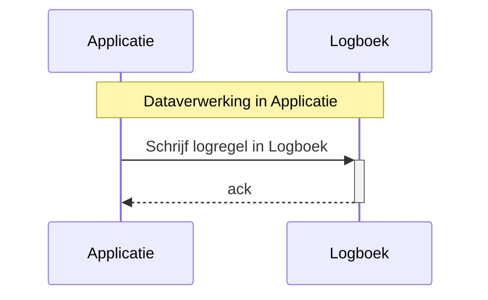
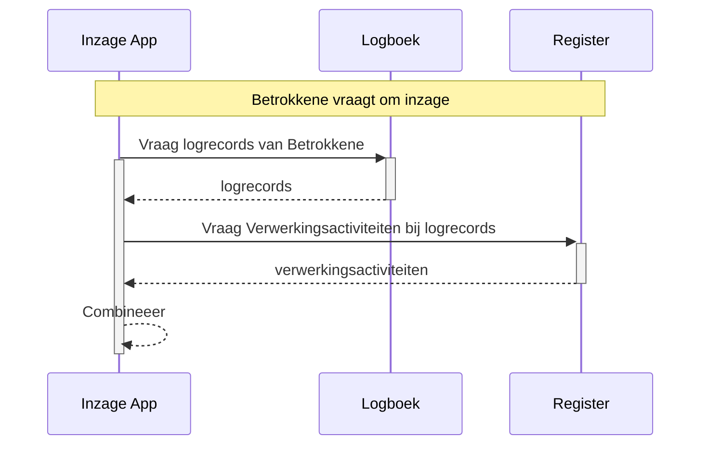

# Logregels bevatten geen gegevens die al vastliggen in een Register

- Status: proposed
- Datum: 2024-02-01

## Context en probleemstelling

Om te optimaliseren voor de het lezen en begrijpen van de logs is het denkbaar om de benodigde informatie redundant weg te schrijven in elk logrecord, zodat er geen afhankelijkheid bestaat van andere bronnen.

Dit heeft nadelen, zoals:

- Wanneer de statische gegevens (zoals bewaartermijn, verantwoordelijke, etc.) wijzigen, zou dit moeten worden aangepast in alle logrecords. Dat verhoudt zich slecht tot het 'inmutable' zijn van deze logrecords.
- De grote vrijheid in alle clients om invulling te geven aan deze gegevens leidt er vrijwel zeker toe dat verdere divergentie optreedt. Dit heeft o.a. tot gevolg dat het lastig wordt om te rapporteren uit de logs
- De API voor het wegschrijven van logs wordt ingewikkeld en relatief traag voor het wegschrijven van records

In de gewenste situatie:

- staan alle statische gegevens in het Register van de Verwerkingsactiviteiten (RvVA), en bevatten logrecords verwijzigen naar dat Register. Specifiek gaat dit om de resources 'verwerkingsactiviteiten' en 'organisaties'.
- kan bij het configureren van clients in de RvVA-API worden opgezocht welke organisaties en verwerkingsactiviten van toepassing zijn
- kunnen wijzigingen in verwerkingsactiviteiten worden doorgevoerd zonder dat logrecords gewijzigd behoeven te worden

Met name het wegschrijven van logs kan op deze manier met hogere performance worden uitgevoerd. Dit kan nog verder worden geoptimaliseerd door niet te vereisen dat dit middels REST API calls gebeurt, maar een interface te definiëren die kan worden geïmplementeert met bijvoorbeeld gRPC of andere streaming protocollen.

Wanneer het aan de gebruiker is om in de software die de Logboek API aanroept de namen van acties, de vetrouwelijkheid en de bewaartermijn te bepalen, zal de invulling daarvan op allerlei manieren uiteen gaan lopen. Door dit in het RvVA te bepalen zal eerder uniformering plaatsvinden. De vulling van RvVA's kan waarschijnlijk zelfs in hoge mate gestandaardiseerd worden.

Met meer gestandaardiseerde namen en bewaartermijnenen en een eenduidige omgang met vertrouwelijkheid is het ook eenvoudiger om eenduidige te communiceren naar de Betrokkene. Bijvoorbeeld: een portaal dat aan de Betrokkene toont hoe de persoonsgegevens zijn verwerkt, is lastig vorm te geven wanneer in de praktijk blijkt dat software-leveranciers verschillende interpretaties hebben van het niveau waarbij sprake is van een verwerking, handeling of actie. Eenduidige interpretatie is cruciaal, en dit kan waarschijnlijk alleen in het RvVA.

Overigens werkt het conceptueel wél wanneer men geen API op het RvVA aanbiedt, deze link kan ook handmatig worden gelegd iedere keer als deze informatie nodig is, en het RvVA bijvoorbeeld alleen bestaat als Excel document.

## Besluit

Logregels bevatten geen informatie over Verwerkingsactiviteiten en Verantwoordelijkheden die al vastliggen in een Register

## Gevolgen

- In de standaard Logboek Dataverwerkingen is het nodig om ook de benodigde interface op de RvVA te standaardiseren. Dit is nodig om de logs geautomatiseerd en realtime te kunnen interpreteren: zonder gestandaardiseerde manier om informatie over verwerkingsactiviteiten op te vragen kan men aan logregels niet zien of het verwerkingen, handelingen of acties betreft.

Met de volgende sequentie diagrammen wordt in beeld gebracht wat de gevolgen zijn voor de diverse flows in het gebruik van de standaard.

### Loggen van een verwerking

Het wegschrijven van een verwerking in de log-API is uiterst simpel:

Deze transactie is geoptimaliseerd op eenvoud en snelheid, want deze heeft rechtstreeks invloed op de snelheid van verwerkingen. Deze transactie moet schaalbaar zijn naar bijv. tienduizenden transacties per seconde.

### Tonen van een verwerking

Voor het op betekenisvolle manier tonen van verwerkingen aan bijvoorbeeld een Betrokkene is het dan nodig om gegevens op te vragen uit zowel de logs als het RvVA. Deze flow mag wat complexer zijn, omdat deze niet voor alle vastgelegde data wordt uitgevoerd en het belang van de bevraging rechtvaardigt dat een bevraging wat langer kan duren.

