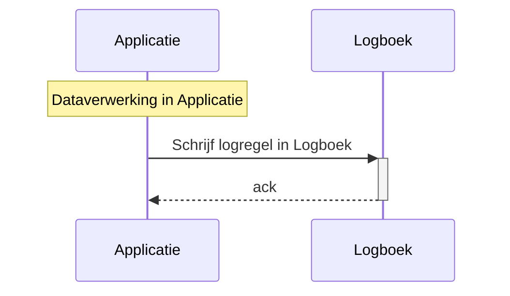
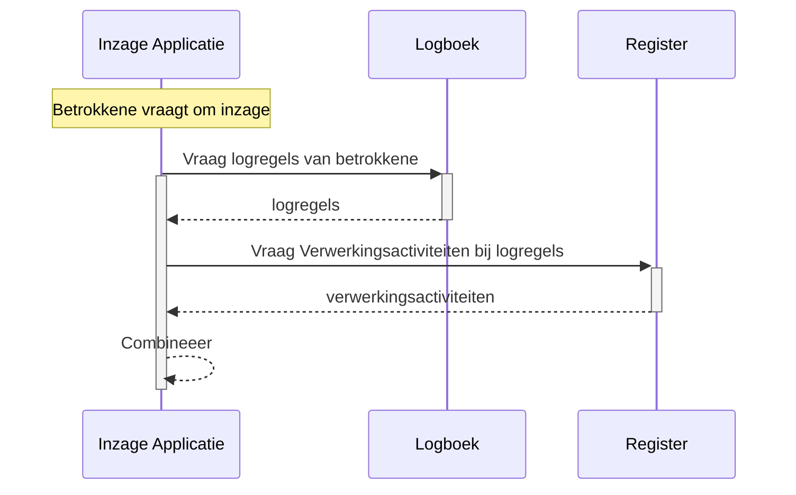

# Flows

## Wegschrijven van een logregel na een Dataverwerking

Deze transactie is geoptimaliseerd op eenvoud en snelheid, want deze heeft rechtstreeks invloed op de snelheid van Dataverwerkingen. Deze transactie moet schaalbaar zijn naar bijv. honderdduizenden transacties per seconde, o.a. omdat wanneer bij een enkele Dataverwerking meerdere Betrokkenen gerelateerd zijn, voor elk van deze Betrokkenen een logregel wordt weggeschreven.

## Tonen van informatie over een Dataverwerking

Voor het op betekenisvolle manier tonen van informatie over Dataverwerkingen aan bijvoorbeeld een Betrokkene is het nodig om gegevens op te vragen uit zowel het Logboek als het Register. Deze flow mag wat complexer zijn, omdat deze niet voor alle vastgelegde data wordt uitgevoerd en het belang van de bevraging rechtvaardigt dat een bevraging wat langer kan duren.

